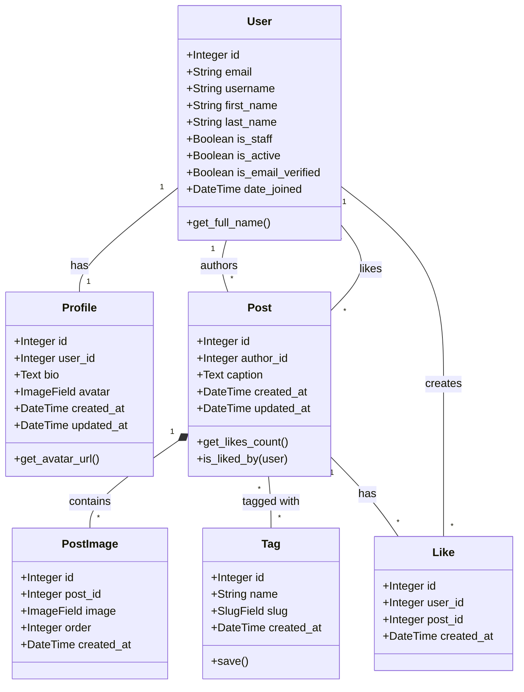

# djgramm Database Schema

## ER Diagram (Mermaid)

## Опис Моделей та Логіки

### 1. User (AbstractUser)

Розширена стандартна модель користувача Django.

- **email**: Основний ідентифікатор (унікальний). Використовує стандартні `Django Validators` для перевірки формату.
- **first_name**, **last_name**: Ім'я та прізвище.
- **is_email_verified**: Прапорець підтвердження пошти.
- _(Верифікація реалізується через View та Django `default_token_generator`, без додаткових методів у моделі)_

### 2. Profile

Додаткова інформація про користувача.

- **user**: Зв'язок One-to-One з User.
- **bio**: Короткий опис про себе.
- **avatar**: Фото профілю.
  _(Поле `full_name` прибрано, щоб уникнути дублювання з User)_

### 3. Post

Основна одиниця контенту.

- **author**: Зв'язок ForeignKey з User.
- **caption**: Текстовий опис.
- **tags**: Зв'язок Many-to-Many з Tag.

### 4. PostImage

Зображення для поста (підтримка галереї).

- **post**: Зв'язок ForeignKey з Post.
- **image**: Файл зображення.
- **order**: Порядок відображення в каруселі.

### 5. Interactions (Like)

- **Like**: Проміжна таблиця для зв'язку User-Post (хто лайкнув що).
  - Унікальність пари `[user, post]` (не можна лайкнути двічі).
