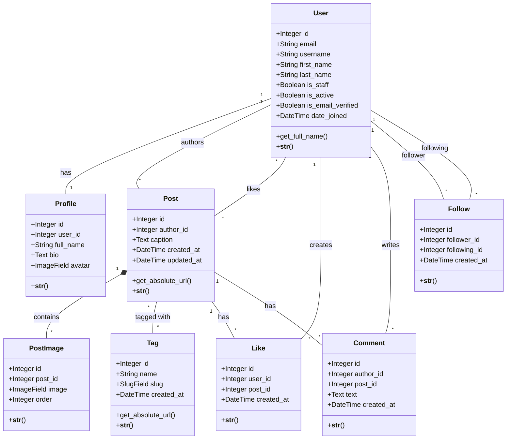

# djgramm Database Schema

## ER Diagram (Mermaid)

## Опис Моделей та Логіки

### 1. User (AbstractUser)

Розширена стандартна модель користувача Django.

- **email**: Основний ідентифікатор (унікальний). Використовує стандартні `Django Validators` для перевірки формату.
- **username**: Ім'я користувача (обов'язкове поле).
- **first_name**, **last_name**: Ім'я та прізвище (від AbstractUser).
- **is_email_verified**: Прапорець підтвердження пошти.
- **get_full_name()**: Метод від AbstractUser, повертає повне ім'я.
- _(Верифікація реалізується через View та Django `default_token_generator`, без додаткових методів у моделі)_

### 2. Profile

Додаткова інформація про користувача.

- **user**: Зв'язок One-to-One з User (`related_name="profile"`).
- **full_name**: Повне ім'я користувача (CharField, max_length=100, blank=True).
- **bio**: Короткий опис про себе (TextField, max_length=500, blank=True).
- **avatar**: Фото профілю (ImageField, upload_to="avatars/", blank=True).
- Створюється автоматично через сигнал при створенні User.

### 3. Post

Основна одиниця контенту.

- **author**: Зв'язок ForeignKey з User (`related_name="posts"`).
- **caption**: Текстовий опис (TextField, max_length=2200, blank=True).
- **tags**: Зв'язок Many-to-Many з Tag (`related_name="posts"`, blank=True).
- **created_at**: Дата створення (auto_now_add=True).
- **updated_at**: Дата оновлення (auto_now=True).
- **get_absolute_url()**: Повертає URL детального перегляду поста.
- Сортування: `-created_at` (найновіші спочатку).

### 4. PostImage

Зображення для поста (підтримка галереї).

- **post**: Зв'язок ForeignKey з Post (`related_name="images"`).
- **image**: Файл зображення (ImageField, upload_to="posts/").
- **order**: Порядок відображення в каруселі (PositiveIntegerField, default=0).
- Сортування: `order` (за порядком).

### 5. Tag

Теги для категорізації постів.

- **name**: Назва тегу (CharField, max_length=50, unique=True).
- **slug**: URL-дружній ідентифікатор (SlugField, unique=True).
- **created_at**: Дата створення (auto_now_add=True).
- **get_absolute_url()**: Повертає URL сторінки постів з цим тегом.
- Сортування: `name` (алфавітний порядок).

### 6. Like

Лайки на постах.

- **user**: Зв'язок ForeignKey з User (`related_name="likes"`).
- **post**: Зв'язок ForeignKey з Post (`related_name="likes"`).
- **created_at**: Дата створення (auto_now_add=True).
- Унікальність пари `[user, post]` через `unique_together` (не можна лайкнути двічі).

### 7. Comment

Коментарі до постів.

- **author**: Зв'язок ForeignKey з User (`related_name="comments"`).
- **post**: Зв'язок ForeignKey з Post (`related_name="comments"`).
- **text**: Текст коментаря (TextField, max_length=500).
- **created_at**: Дата створення (auto_now_add=True).
- Сортування: `created_at` (хронологічний порядок).

### 8. Follow

Підписки між користувачами (Following/Followers).

- **follower**: Зв'язок ForeignKey з User (`related_name="following"`) — користувач, який підписується.
- **following**: Зв'язок ForeignKey з User (`related_name="followers"`) — користувач, на якого підписуються.
- **created_at**: Дата підписки (auto_now_add=True).
- Унікальність пари `[follower, following]` через `unique_together` (не можна підписатися двічі на одного користувача).
- Сортування: `-created_at` (найновіші спочатку).

## Зв'язки між моделями

1. **User ↔ Profile**: One-to-One (кожен користувач має один профіль)
2. **User → Post**: One-to-Many (користувач може мати багато постів)
3. **Post → PostImage**: One-to-Many (пост може мати багато зображень)
4. **Post ↔ Tag**: Many-to-Many (пост може мати багато тегів, тег може бути на багатьох постах)
5. **User ↔ Post (через Like)**: Many-to-Many (користувач може лайкнути багато постів, пост може мати багато лайків)
6. **User → Comment**: One-to-Many (користувач може написати багато коментарів)
7. **Post → Comment**: One-to-Many (пост може мати багато коментарів)
8. **User ↔ User (через Follow)**: Many-to-Many (користувач може підписатися на багато користувачів, на користувача може підписатися багато інших)
